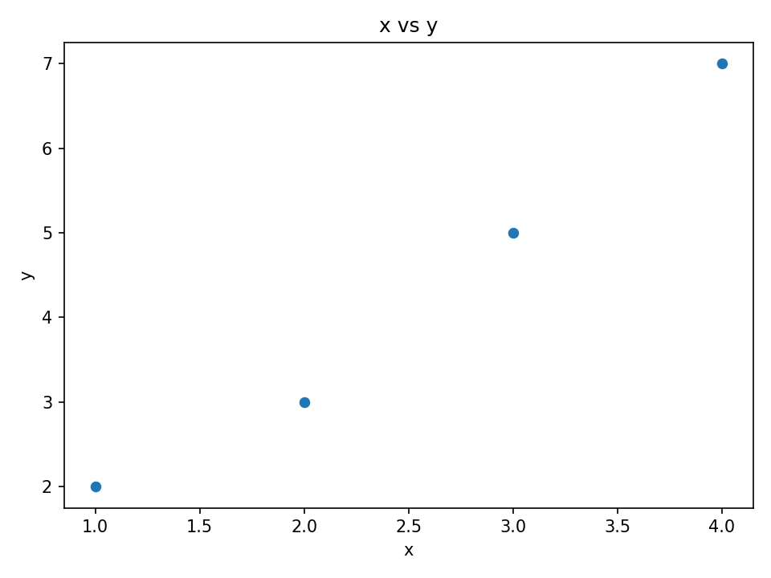
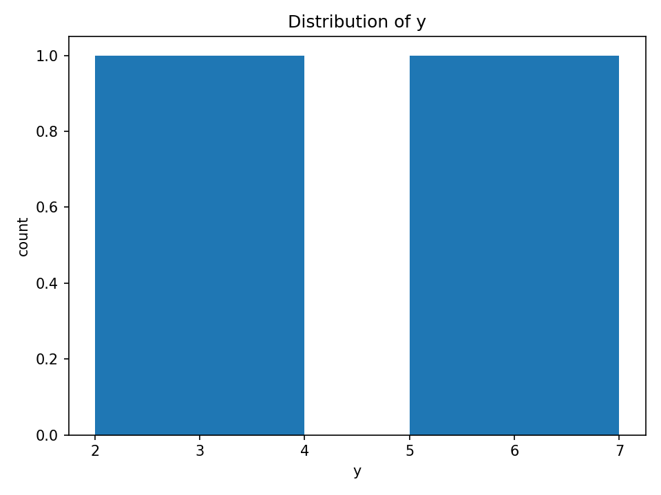
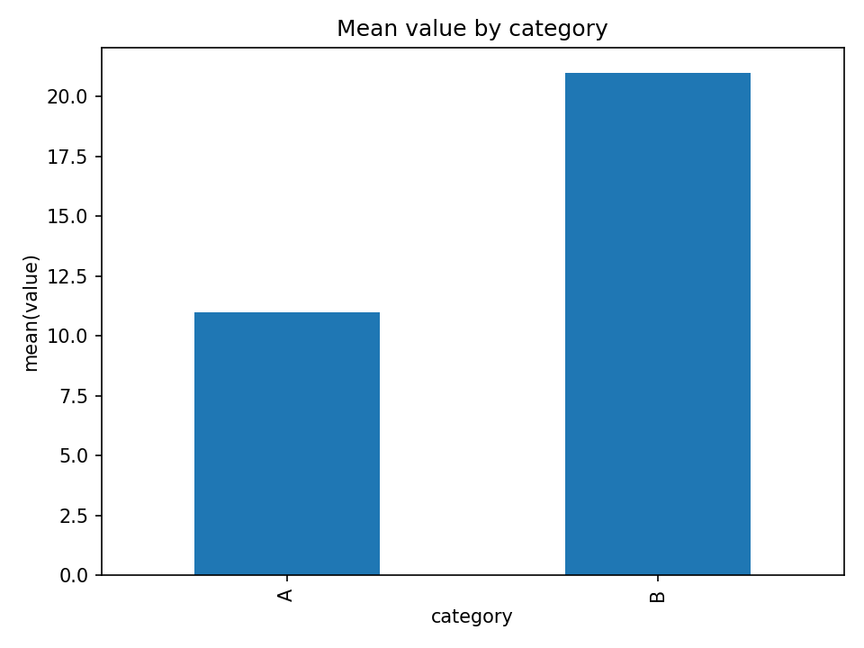
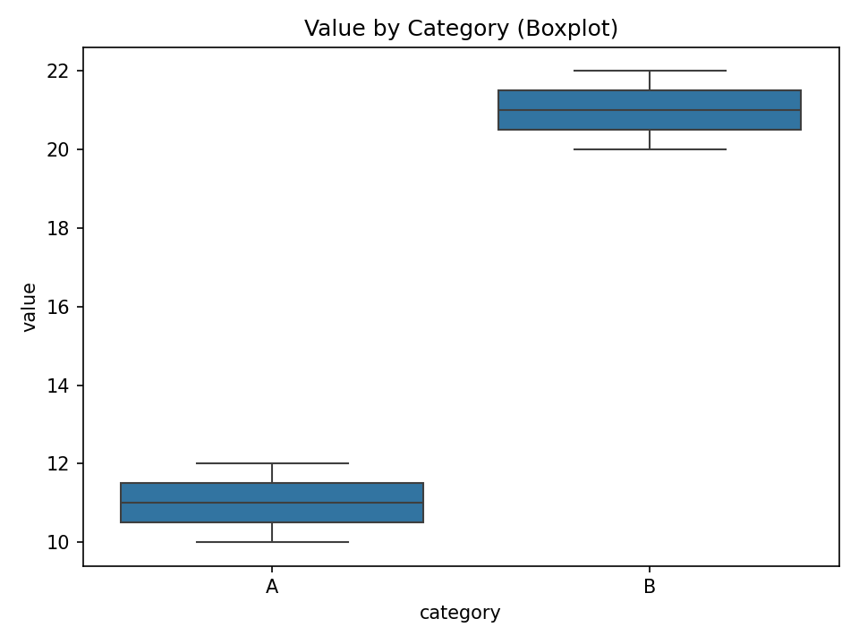
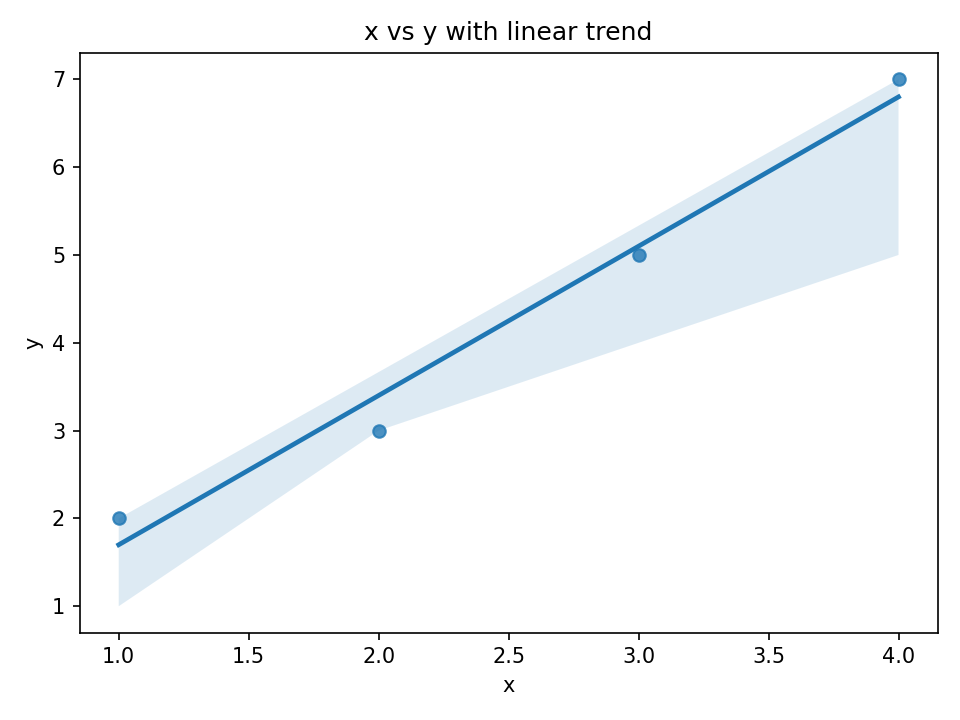
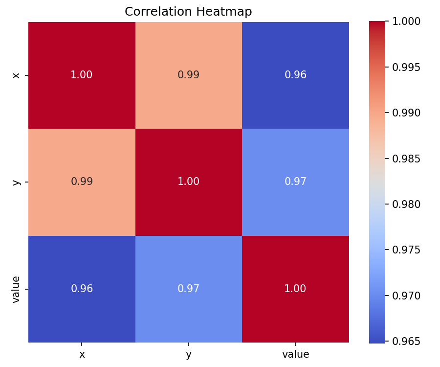
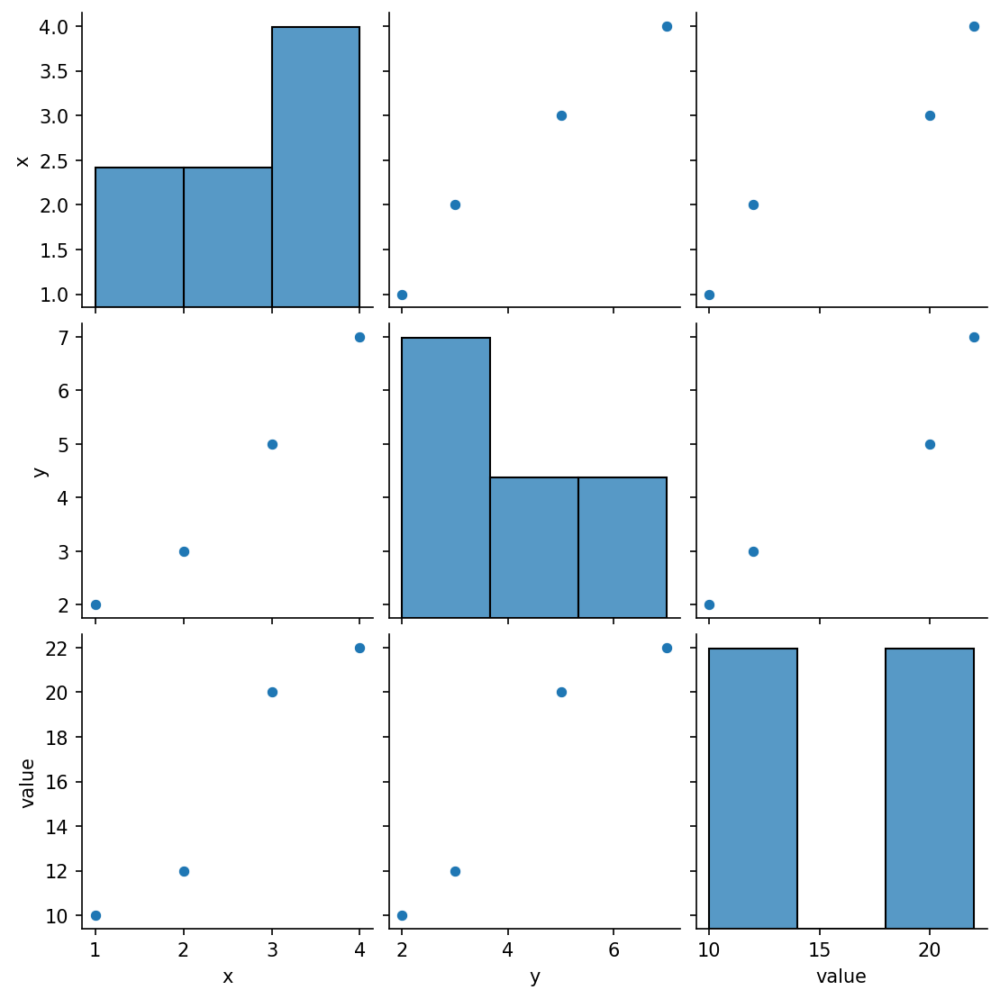

# 🧭 Data Analysis Starter Guide (Pandas + Matplotlib + Seaborn)

A **practical, beginner-friendly reference** for foundational data analysis tasks using Python.

---

## 📘 Table of Contents

### 🔗 Quick Navigation

| Section                                                                              | Description                                        |
| ------------------------------------------------------------------------------------ | -------------------------------------------------- |
| [1️⃣ Prerequisites & Setup](#🧩-1-prerequisites--setup)                              | Prepare your environment and install core packages |
| [2️⃣ Imports & Reading Data](#📂-2-imports--reading-data)                            | Load and read datasets (CSV/Excel)                 |
| [3️⃣ Quick Overview](#🔎-3-quick-overview)                                           | Inspect structure, types, and stats                |
| [4️⃣ Cleaning (NaNs, Duplicates, Renaming)](#🧹-4-cleaning-nans-duplicates-renaming) | Handle missing values and clean columns            |
| [5️⃣ Zero Counting](#🔢-5-zero-counting)                                             | Identify zero placeholders                         |
| [6️⃣ Selection & Filtering](#🎯-6-selection--filtering)                              | Filter data by conditions                          |
| [7️⃣ New Columns & Apply](#🧮-7-new-columns--apply)                                  | Create features and apply functions                |
| [8️⃣ Grouping & Aggregations](#🧠-8-grouping--aggregations)                          | Summarize data per category                        |
| [9️⃣ Pivot Tables](#🔁-9-pivot-tables)                                               | Transform long to wide format                      |
| [🔟 Sorting & Ranking](#🏁-10-sorting--ranking)                                      | Sort and assign ranks                              |
| [1️⃣1️⃣ Merging / Joining](#🔗-11-merging--joining)                                  | Combine datasets by key                            |
| [1️⃣2️⃣ Saving Outputs](#💾-12-saving-outputs)                                       | Export cleaned results                             |
| [1️⃣3️⃣ Correlation Analysis](#📈-13-correlation-analysis)                           | Analyze relationships                              |
| [1️⃣4️⃣ Plotting with Matplotlib](#🎨-14-plotting-with-matplotlib)                   | Build customizable plots                           |
| [1️⃣5️⃣ Plotting with Seaborn](#🌈-15-plotting-with-seaborn)                         | Create elegant visuals                             |
| [1️⃣6️⃣ Common Gotchas](#⚠️-16-common-gotchas)                                       | Avoid common pandas traps                          |
| [1️⃣7️⃣ Comprehensive Cheat Sheet](#🧾-17-comprehensive-cheat-sheet)                 | Full end-to-end workflow                           |

---

## 🧩 1) Prerequisites & Setup

**Purpose:** prepare your environment so every notebook/script runs consistently.

### 📦 Install Required Packages

```bash
# Install essential libraries
pip install pandas numpy matplotlib seaborn 
```

| Library          | Purpose                                           |
| ---------------- | ------------------------------------------------- |
| **pandas**       | Data manipulation & cleaning (DataFrame handling) |
| **numpy**        | Numerical computing & array ops                   |
| **matplotlib**   | Low-level plotting & figure control               |
| **seaborn**      | High-level, clean statistical visuals             |

---


## 📂 2) Imports & Reading Data

**Purpose:** load libraries and import your dataset.

```python
import pandas as pd               # data handling
import numpy as np                # numerical operations
import matplotlib.pyplot as plt   # visualization
import seaborn as sns             # statistical plots

# Read CSV or Excel file
df = pd.read_csv("students.csv")   # load CSV file into DataFrame
# df = pd.read_excel("data.xlsx", sheet_name=0)  # Excel alternative
```

---

## 🔎 3) Quick Overview

**Purpose:** understand structure, data types, and basic statistics.

```python
df.head()                        # preview first 5 rows
df.shape                         # get (rows, columns)
df.dtypes                        # data types of columns
df.info()                        # summary: non-null count + types
df.describe()                    # summary stats for numeric columns
df.describe(include="object")    # summary stats for categorical data
```


**Example**

**Input**

```
name,math,english
John,85,78
Emma,90,88
David,76,70
```

**Code**

```python
df.head()
```

**Output**

```
   name  math  english
0  John   85      78
1  Emma   90      88
2  David  76      70
```

---

## 🧹 4) Cleaning (NaNs, Duplicates, Renaming)

**Purpose:** handle missing data, duplicates, and rename columns.

```python
df.isnull().sum()                                   # count missing values per column
df = df.dropna()                                    # drop rows with NaN values
df = df.drop_duplicates()                           # remove duplicate rows
df = df.rename(columns={"math": "Mathematics"})     # rename a column
# Alternative: convert non-numeric to NaN then fill
df["Mathematics"] = pd.to_numeric(df["Mathematics"], errors="coerce").fillna(df["Mathematics"].median())
```

**Example**

**Input**

```
name,math,english
John,85,78
Emma,,88
David,76,70
John,85,78
```

**Code**

```python
df = df.dropna()
```

**Output**

```
   name  Mathematics  english
0  John          85       78
2  David         76       70
```

---

## 🔢 5) Zero Counting

**Purpose:** count zero values to detect placeholder entries.

```python
(df == 0).sum()                  # count zeros per column
(df == 0).mean() * 100           # percentage of zeros
df[df["math"] == 0]             # filter rows with zeros in math
```

**Example**

**Input**

```
   math  english
0    85       78
1     0       65
2    76        0
3     0       90
```

**Code**

```python
(df == 0).sum()
```

**Output**

```
math: 2  |  english: 1
```

---

## 🎯 6) Selection & Filtering

**Purpose:** extract rows/columns based on conditions.

```python
df["name"]                               # select single column (Series)
df[["name", "age"]]                      # select multiple columns
mask = (df["age"] > 30) & df["city"].isin(["London", "Berlin"])
df_filtered = df[mask]                    # filtered rows by condition
```

**Example**

**Input**

```
   name  age    city
0  John   35  London
1  Emma   25   Paris
2  David  40  Berlin
```

**Code**

```python
df_filtered = df[(df["age"] > 30) & df["city"].isin(["London", "Berlin"])]
```

**Output**

```
   name  age    city
0  John   35  London
2  David  40  Berlin
```

---

## 🧮 7) New Columns & Apply

**Purpose:** engineer new features.

```python
df["total"] = df["price"] * df["qty"]                        # simple math
def price_level(v):                                           # custom logic
    return "high" if v > 100 else "low"
df["price_bin"] = df["price"].apply(price_level)              # apply function row-wise
```

**Example**

**Input**

```
price,qty
80,2
120,1
50,3
```

**Code**

```python
df["total"] = df["price"] * df["qty"]
```

**Output**

```
price  qty  total
80      2    160
120     1    120
50      3    150
```

---

## 🧠 8) Grouping & Aggregations

**Purpose:** summarize metrics per group.

```python
mean_by_cat = df.groupby("category")["sales"].mean()             # mean sales per category
summary = df.groupby("category")["sales"].agg(["mean", "sum", "count"])  # multi-metric aggregation
```

**Example**

**Input**

```
category,sales
A,100
B,200
A,150
B,250
```

**Code**

```python
summary = df.groupby("category")["sales"].agg(["mean", "sum", "count"])
```

**Output**

```
category  mean  sum  count
A         125   250  2
B         225   450  2
```

---

## 🔁 9) Pivot Tables

**Purpose:** reshape data into summarized matrix.

```python
pt = pd.pivot_table(df, values="sales", index="region", columns="year", aggfunc="sum", fill_value=0)
```

**Example**

**Input**

```
region,year,sales
North,2023,10
North,2024,15
South,2023,20
South,2024,25
```

**Code**

```python
pt = pd.pivot_table(df, values="sales", index="region", columns="year", aggfunc="sum", fill_value=0)
```

**Output**

```
year    2023  2024
region             
North     10    15
South     20    25
```

---

## 🏁 10) Sorting & Ranking

**Purpose:** order and rank values.

```python
df = df.sort_values("sales", ascending=False)             # sort descending by sales
df["rank"] = df["sales"].rank(method="dense", ascending=False)  # assign rank
```

**Example**

**Input**

```
product,sales
A,300
B,150
C,500
```

**Code**

```python
df = df.sort_values("sales", ascending=False)
```

**Output**

```
product sales rank
C       500   1
A       300   2
B       150   3
```

---

## 🔗 11) Merging / Joining

**Purpose:** combine datasets.

```python
inner = pd.merge(df1, df2, on="id", how="inner")  # intersection
left  = pd.merge(df1, df2, on="id", how="left")   # keep all left rows
```

**Example**

**Input**

```
# df1            # df2
id name          id score
1  John          1   90
2  Emma          2   85
3  David         4   75
```

**Code**

```python
inner = pd.merge(df1, df2, on="id", how="inner")
```

**Output**

```
id name  score
1  John  90
2  Emma  85
```

---

## 💾 12) Saving Outputs

**Purpose:** export processed data.

```python
df.to_csv("output.csv", index=False)           # save to CSV
df.to_excel("output.xlsx", index=False)        # save to Excel
```

**Example**

**Code**

```python
df.to_csv("output.csv", index=False)
```

**Output**

```
File 'output.csv' successfully saved.
```

---

## 📈 13) Correlation Analysis

**Purpose:** evaluate relationships between numeric features.

```python
corr = df.select_dtypes(include=np.number).corr()         # compute correlation matrix
sns.heatmap(corr, annot=True, cmap="coolwarm")           # visualize correlations
```

**Example**

**Input**

```
x,y,z
1,2,8
2,4,7
3,6,3
4,8,1
```

**Code**

```python
corr = df.corr()
```

**Output**

```
      x     y     z
x  1.00  1.00 -0.82
y  1.00  1.00 -0.89
z -0.82 -0.89  1.00
```
---

## 🎨 14) Plotting with Matplotlib

**Purpose:** create customizable visualizations.

```python
# Scatter Plot
plt.scatter(df["x"], df["y"], s=30)
plt.xlabel("x"); plt.ylabel("y"); plt.title("x vs y")
plt.tight_layout(); plt.savefig("plots/14_scatter.png", dpi=150); plt.show()

# Histogram
plt.hist(df["y"].dropna(), bins=20)
plt.xlabel("y"); plt.ylabel("count"); plt.title("Distribution of y")
plt.tight_layout(); plt.savefig("plots/14_hist.png", dpi=150); plt.show()

# Bar Plot
mean_by_cat = df.groupby("category")["value"].mean().sort_values()
mean_by_cat.plot(kind="bar")
plt.ylabel("mean(value)"); plt.title("Mean by Category")
plt.tight_layout(); plt.savefig("plots/14_bar.png", dpi=150); plt.show()
```

<table align="center" style="width:100%; text-align:center;">
<tr>
<td><b>Scatter</b><br></td>
<td><b>Histogram</b><br></td>
<td><b>Bar Chart</b><br></td>
</tr>
</table>

---

## 🌈 15) Plotting with Seaborn

**Purpose:** quick, elegant, and statistical visualization.

```python
# Boxplot
sns.boxplot(data=df, x="category", y="value")
plt.title("Value by Category"); plt.tight_layout(); plt.savefig("plots/15_boxplot.png", dpi=150); plt.show()

# Regression Plot
sns.regplot(data=df, x="x", y="y")
plt.title("x vs y with trend"); plt.tight_layout(); plt.savefig("plots/15_regplot.png", dpi=150); plt.show()

# Heatmap
corr = df.select_dtypes(include=np.number).corr()
sns.heatmap(corr, annot=True, fmt=".2f", cmap="coolwarm", square=True)
plt.title("Correlation Heatmap"); plt.tight_layout(); plt.savefig("plots/15_heatmap.png", dpi=150); plt.show()

# Pairplot
g = sns.pairplot(df[["x", "y", "value"]])
g.savefig("plots/15_pairplot.png", dpi=150)
```

<table align="center" style="width:100%; text-align:center;">
<tr>
<td><b>Boxplot</b><br></td>
<td><b>Regression Plot</b><br></td>
</tr>
<tr>
<td><b>Heatmap</b><br></td>
<td><b>Pairplot</b><br></td>
</tr>
</table>


---
## ⚠️ 16) Common Gotchas

**Purpose:** avoid pandas pitfalls.

```python
# Wrong: modifies a copy, not original
df[df["age"]>30]["flag"] = 1

# Correct: always use .loc for safe assignment
df.loc[df["age"]>30, "flag"] = 1

# Convert mixed types safely
df["col"] = pd.to_numeric(df["col"], errors="coerce")
```

**Example**

**Input**

```
age
25
31
40
```

**Code**

```python
df.loc[df["age"]>30, "flag"] = 1
```

**Output**

```
age  flag
25   NaN
31   1.0
40   1.0
```

---

## 🧾 17) Comprehensive Cheat Sheet

**Purpose:** a full workflow to analyze any dataset from import to export.

```python
# 1️⃣ IMPORT & INSPECT
import pandas as pd, numpy as np, matplotlib.pyplot as plt, seaborn as sns
df = pd.read_csv("data.csv")                     # read CSV file
print(df.shape)                                  # check dimensions
print(df.info())                                 # view column types & nulls
print(df.describe())                             # numeric summary
print(df.describe(include="object"))             # categorical summary

# 2️⃣ CLEANING
df = df.drop_duplicates()                        # remove duplicates
df = df.dropna(subset=["price", "qty"], how="any")   # remove NaNs

# 3️⃣ FEATURE ENGINEERING
df["total"] = df["price"] * df["qty"]              # create total revenue
df["price_bin"] = df["price"].apply(lambda x: "high" if x > 100 else "low")

# 4️⃣ SELECTION & FILTERING
high_value = df[df["total"] > 500]               # filter by condition
subset = df.loc[0:5, ["product", "price", "qty"]]  # label-based subset

# 5️⃣ GROUPING & AGGREGATION
grouped = df.groupby("category")["total"].agg(["mean", "sum", "count"])

# 6️⃣ VISUALIZATION
plt.figure(figsize=(6,4))
plt.hist(df["total"], bins=20)
plt.title("Distribution of Total Sales")
plt.xlabel("Total"); plt.ylabel("Count")
plt.tight_layout(); plt.show()

# 7️⃣ CORRELATION
num = df.select_dtypes(include=np.number)
sns.heatmap(num.corr(), annot=True, cmap="coolwarm")
plt.title("Feature Correlation Matrix"); plt.show()

# 8️⃣ EXPORT RESULTS
df.to_csv("output.csv", index=False)
```
